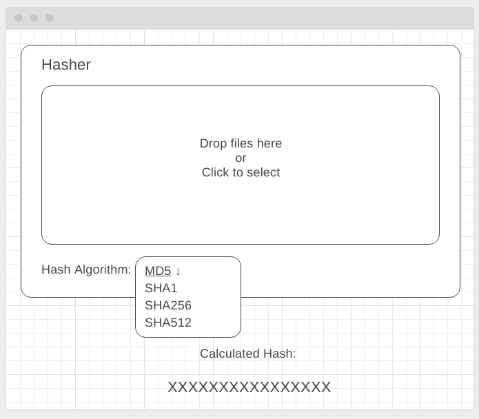

#### Deployment: <a href="">Github Pages</a>

---

### Hasher

#### Легенда

Периодически необходимо проверять контрольные суммы различных файлов, чтобы удостовериться, что при передаче с этими файлами не произошло ничего плохого. Конечно, для этого уже есть готовые инструменты, но всё равно пользователи пользуются какими-то онлайн-сервисами, загружая туда конфиденциальные файлы.

Поэтому ваш руководитель решил, что можно это сделать и на корпоративном портале (чтобы ничего никуда не загружалось) через браузер с помощью специальной библиотеки [crypto-js](https://github.com/brix/crypto-js/), что вам и предстоит сделать.

#### Описание

Вам необходимо скачать и установить библиотеку crypto-js, делается это стандартным способом через npm или yarn.

Внешний интерфейс виджета должен выглядеть следующим обазом:



Хэш автоматически пересчитывается при выборе другого алгоритма хеширования (выпадающее меню) или выбора другого файла.

Файлы могут загружаться как выбором (при клике на область должен открываться стандартный интерфейс выбора файла в браузере), так и DnD.

Поскольку ваш виджет в дальнейшем могут захотеть использовать в составе других интерфейсов, крайне нежелательно, чтобы загрузка файла и расчёт контрольной суммы приводили к зависанию интерфейса.  Поэтому их необходимо вынести в Web Worker. 

Функции crypto-js требуют объекты специального внутреннего формата `WordArray`. Получить из `ArrayBuffer` его и рассчитать хэш можно с помощью следующего кода:
```javascript
const wordArray = crypto.lib.WordArray.create(<array buffer here>);
const hash = crypto.MD5(wordArray).toString(crypto.enc.Hex);
```

`hash` - и есть полученная контрольная сумма, рассчитанная по алгоритму MD5. Вам, естественно, нужно сделать поддержку не только MD5, а ещё и:
* crypto-js/sha1
* crypto-js/sha256
* crypto-js/sha512

Продумайте, как вы будете проверять, что ваше приложение считает хэш правильно.

---